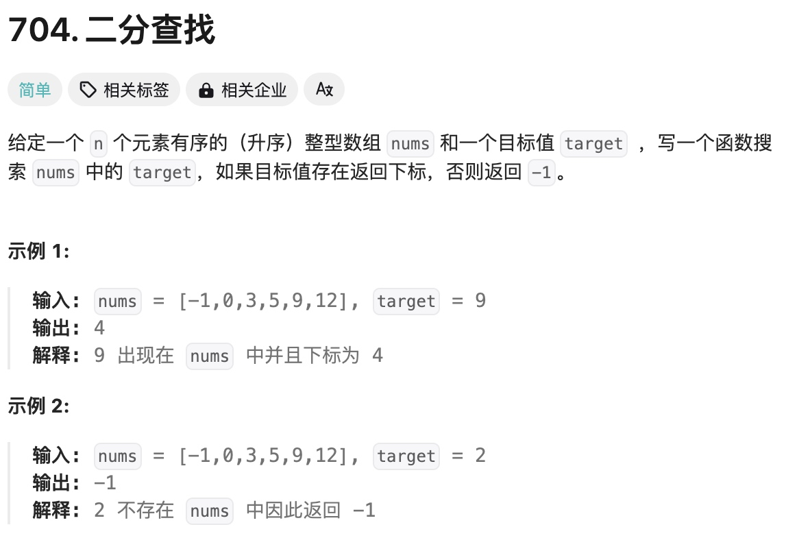
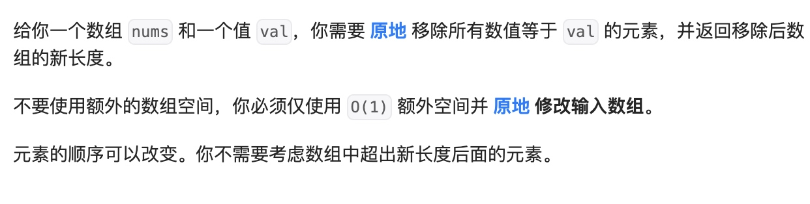
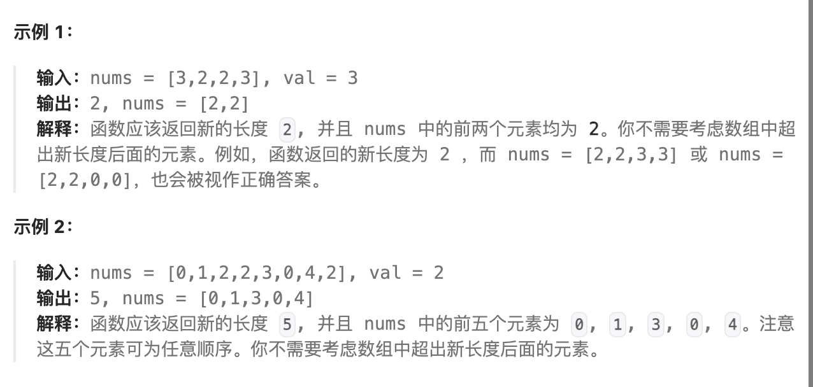
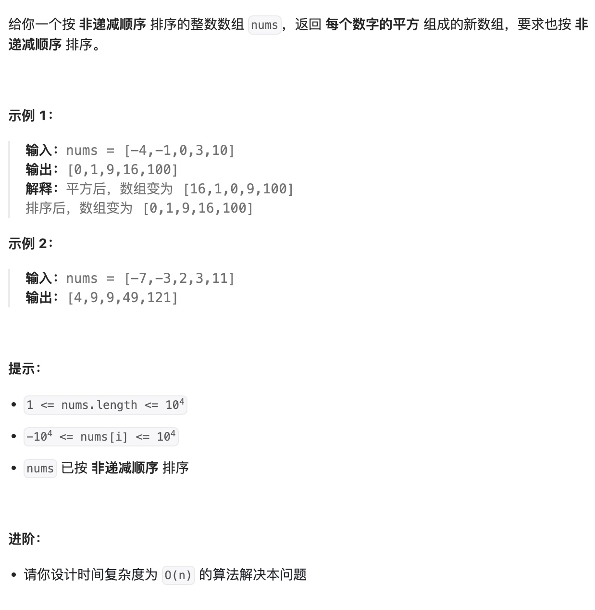
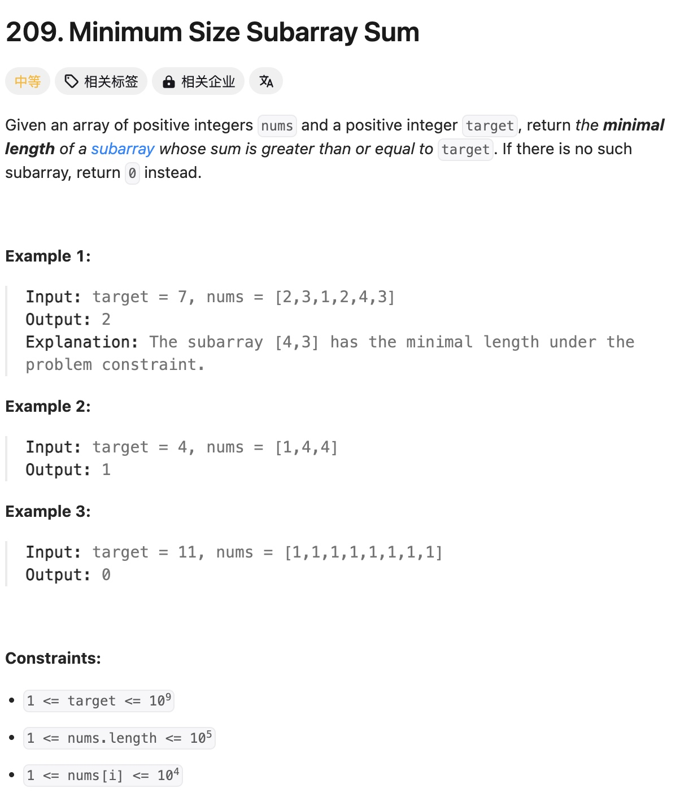
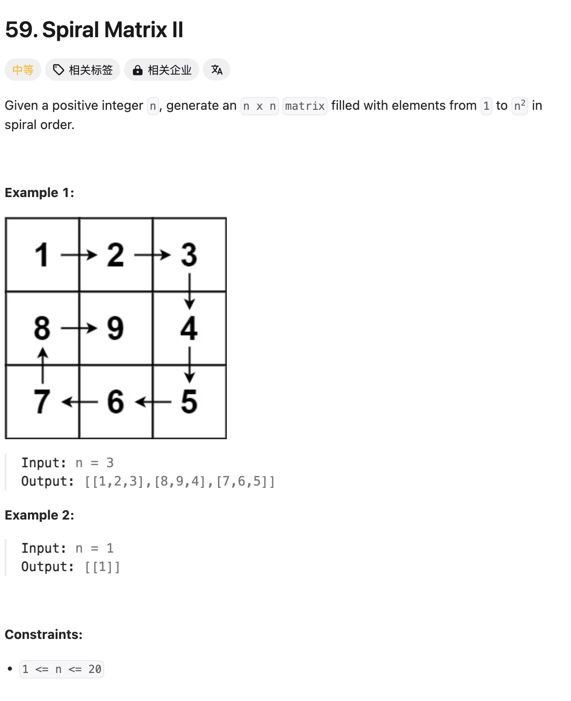

# 数组
## 01.二分查找


```java
class Solution {
    public int search(int[] nums, int target) {
        int i = 0;
        int j = nums.length-1;
        int mid =  (i+j)/2;
        while (i <= j){
            if(nums[mid] == target)
                return mid;
            if(nums[mid] > target){
                j = mid - 1;
                mid = (i+j)/2;
            }else {
                i = mid + 1;
                mid = (i+j)/2;
            }
        }
        return -1;
    }
}
```

## 02.移除元素



### 方法一
```java
class Solution {
    public int removeElement(int[] nums, int val) {
         // 检查数组是否为空或长度为0，提前返回
        if (nums == null || nums.length == 0) {
            return 0;
        }

        int index = 0; // 用于记录有效元素的索引
        for (int i = 0; i < nums.length; i++) {
            if (nums[i] != val) {
                // 当找到非目标值时，将其放置在已确认位置（index）
                nums[index] = nums[i];
                index++;
            }
        }
        // 返回有效元素的数量
        return index;
    }
}
```
### 方法二--双指针法
```java
public static int removeElement(int[] nums, int val) {
        int fast = 0;
        int slow = 0;
        while(fast < nums.length){
            if(nums[fast] != val){
                nums[slow] = nums[fast];
                slow++;
            }
            fast++;
        }
        return slow;
    }

```

## 03.有序数组的平方

### 方法一：平方后快排 会超时
```java
public static int[] sortedSquares(int[] nums) {
        for (int i = 0; i < nums.length; i++) {
            nums[i] = nums[i] * nums[i];
        }
        // 使用快速排序
        int head = 0;
        int tail = nums.length - 1;
        while(head < tail){
            if(head < tail && nums[head] > nums[tail]){
                int temp = nums[head];
                nums[head] = nums[tail];
                nums[tail] = temp;
                head++;
            }
            else if(head< tail && nums[head] < nums[tail]){
                tail--;
            }
            if (head <= tail && nums[tail] < nums[head] ){
                int temp = nums[head];
                nums[head] = nums[tail];
                nums[tail] = temp;
                tail--;
            }else if (head <= tail && nums[tail] > nums[head]){
                head++;
            }
        }
        return nums;
    }
```

### 方法二：头尾双指针，因为大的数只能是靠近2边的数。
空间换时间
```java
public static int[] sortedSquares2(int[] nums) {
        for (int i = 0; i < nums.length; i++) {
            nums[i] = nums[i] * nums[i];
        }
        int[] result = new int[nums.length];
        int k = result.length;
        // 使用快速排序
        int head = 0;
        int tail = nums.length - 1;
        while(head <= tail){
            if(nums[head] < nums[tail]){
                result[k-1] = nums[tail];
                k--;
                tail--;
            }else {
                result[k-1] = nums[head];
                k--;
                head++;
            }
        }
        return result;
    }

```

## 04.最小长度子数组

### 方法一：滑动窗口
```java
public static int minSubArrayLen(int target,  int[] nums) {
        int resultLen = Integer.MAX_VALUE;
        int startPoint = 0;
        int sum = 0;
        for (int i = 0; i < nums.length; i++) {
            sum += nums[i];
            while (sum >= target){
                int subLength = i - startPoint + 1;
                resultLen = resultLen > subLength ? subLength : resultLen;
                sum = sum-nums[startPoint];
                startPoint++;
            }
        }
        return resultLen == Integer.MAX_VALUE ? 0 : resultLen;
    }
```

### 方法二：暴力
```java
public static int minSubArrayLen2(int target,  int[] nums) {

        int resultLen = Integer.MAX_VALUE;
        for (int i = 0; i < nums.length; i++) {
            int sum = 0;
            for (int j = i; j < nums.length; j++) {
                sum += nums[j];
                if (sum >= target){
                    resultLen = resultLen > j - i + 1 ? j - i + 1 : resultLen;
                }
            }
        }
        return resultLen == Integer.MAX_VALUE ? 0 : resultLen;
    }
```

## 05.螺旋矩阵II

### 方法一：暴力
```java
int[][] matrix = new int[n][n];
        int lines = 0;
        int columns = 0;
        int count = 1;
        
        // 处理奇数矩阵中心值
        if(n%2 != 0){
            matrix[n/2][n/2] = n*n;
        }
        while (count < n*n+1 && lines < n && columns < n){
            int x = lines;
            int y = columns;
            // 第一行处理完毕
            while (count < n*n+1 && y < n-columns-1){
                matrix[x][y] = count;
                count++;
                y++;
            }
            //处理第一列
            while (count < n*n+1 && x < n-lines-1){
                matrix[x][y] = count;
                count++;
                x++;
            }
            while (count < n*n+1 && y > columns){
                matrix[x][y] = count;
                count++;
                y--;
            }
            while (count < n*n+1 && x > lines){
                matrix[x][y] = count;
                count++;
                x--;
            }
            lines++;
            columns++;
        }
        return matrix;
    }
```